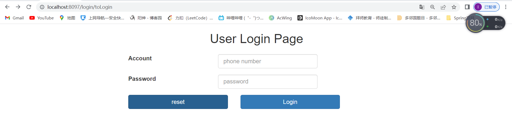
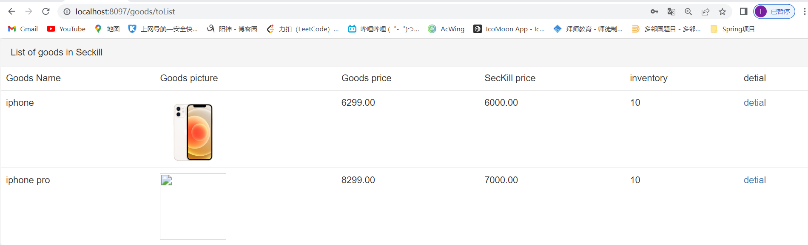
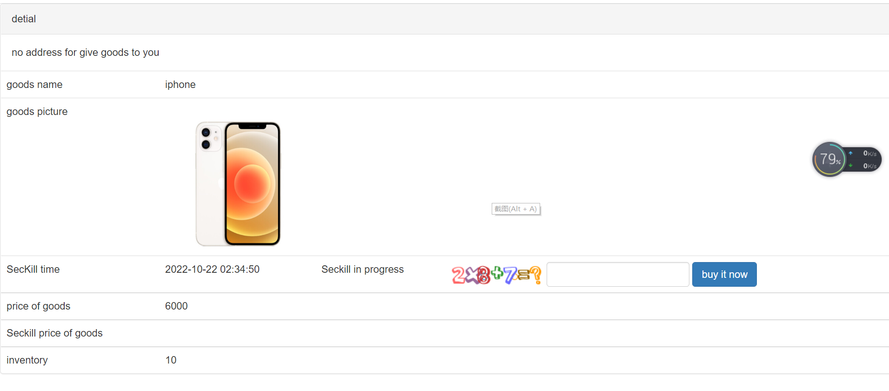
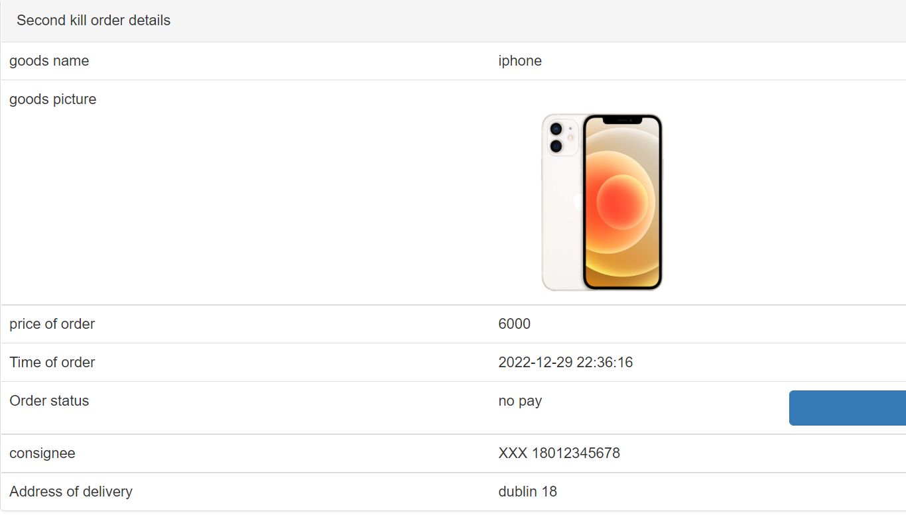
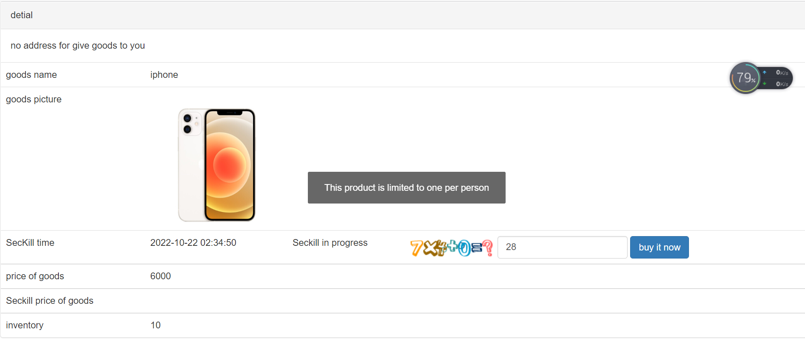
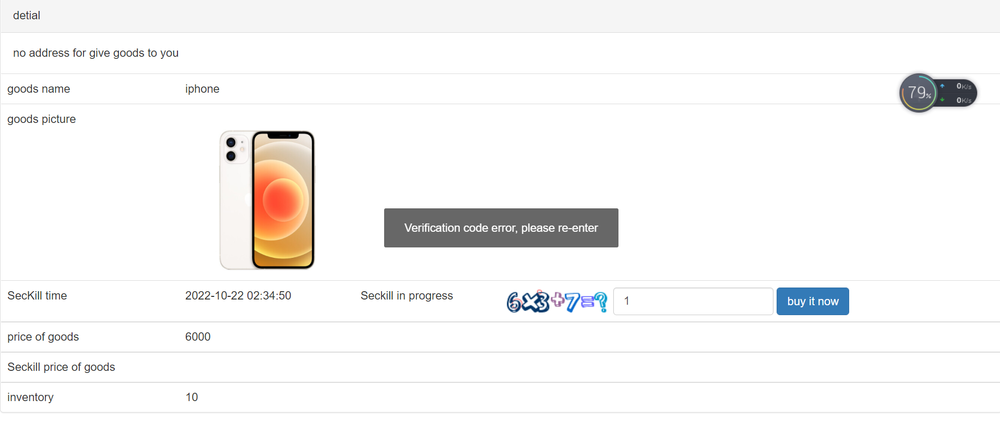

A demonstration video: [Demonstration](https://drive.google.com/file/d/17UmEyb_7AfsdKj5wbV2a3qGk6OTtDsdC/view)

The full project report: [Report](./FinalTeamTemplate.pdf)


# technology stack

- **Java 8**
- **Springboot**
- **RabbitMQ**
- **Redis**
- **Mysql**
- **Mybatis Plus**
- **swagger**
- **lombok**

# Getting start

### Installation & run

1. create docker container for RabbitMQ

   ```shell
   # latest RabbitMQ 3.11
   docker run -it --rm --name rabbitmq -p 5672:5672 -p 15672:15672 rabbitmq:3.11-management
   ```

   

2. create docker container for redis   
    create a dedicated docker network  

    ```shell
    docker network create -d bridge redisnet
    ```

    run redis container
   ```shell
   docker run -d -p 6379:6379 --name redis_test --network redisnet redis
   ```

3. download the project and open the yml configuration file, the redis port number, rabbitMq port number, and mysql-related configuration according to your computer to modify

2. create mysql table and add data according to sqldoc in the file

3. enter the SeckillDemoApplication class to start the project

# APIs

Login：http://localhost:8097/login/toLogin

Swagger：http://localhost:8097/doc.html#/home


# Features

**Login Page**


**Goods List**



**Click detial to enter the seckill**



**Seckill Success**


**Generate order**



# Related error display

**The user has already bought it will prompt an error**



**Captcha input error**



# Member

**Boshen Fan**

**Qiyan Xuan**

**Cheng Zhang**

**Xing Liu**

